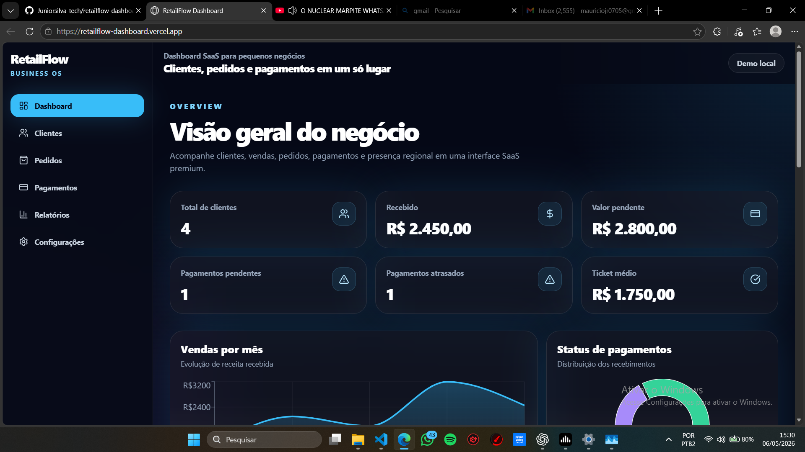
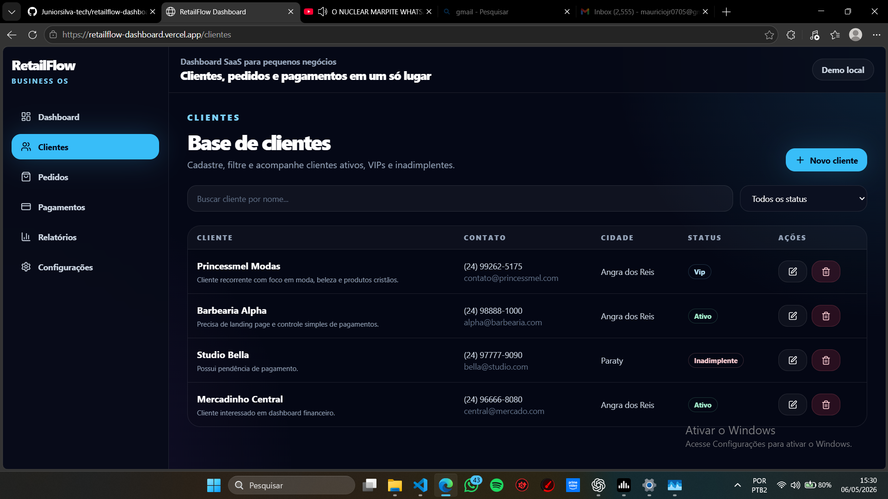

# MJR Forge

> Portfólio Front-end React com UI premium, direção visual cinematográfica e apresentação de produtos digitais modernos.


## Visão geral

O **MJR Forge** é meu portfólio principal como desenvolvedor Front-end React. O projeto foi criado para apresentar minha identidade profissional, meus projetos e minha capacidade de construir interfaces modernas com acabamento visual forte, responsividade e leitura de produto.

A proposta não é ser apenas um site pessoal, mas uma vitrine de **UI premium**, **motion design**, **dashboards**, **landing pages** e experiências digitais com foco em clareza, performance e impacto visual.

---

## Posicionamento

**Front-end React Developer focado em UI premium, dashboards SaaS e interfaces modernas.**

O projeto comunica:

- repertório visual em interfaces digitais;
- domínio de React, Tailwind CSS e Framer Motion;
- cuidado com hierarquia, contraste, spacing e responsividade;
- apresentação de projetos com aparência de produto real;
- motion e atmosfera como suporte à experiência, não como distração.

---

## Links

- **Deploy:** https://mjr-forge-portfolio.vercel.app
- **Repositório:** https://github.com/Juniorsilva-tech/mjr-forge-portfolio
- **GitHub pessoal:** https://github.com/Juniorsilva-tech

---

## Stack


---

## Projeto em destaque no portfólio

### RetailFlow Dashboard

O Forge apresenta o **RetailFlow Dashboard**, uma demo funcional de dashboard SaaS voltada para gestão comercial, clientes, pedidos, pagamentos e relatórios.





---

## Diferenciais visuais

- Hero cinematográfico com estética premium e identidade própria.
- Apresentação de projetos com mockups e screenshots reais.
- Motion design com Framer Motion aplicado de forma moderada.
- UI escura com contraste, profundidade e atmosfera visual.
- Performance adaptativa com perfis de renderização.
- Layout responsivo para desktop e mobile.

---

## Performance

O projeto inclui um sistema de performance com perfis:

- `Auto`
- `Low`
- `Medium`
- `High`

Esse sistema ajuda a controlar camadas visuais, motion, profundidade e efeitos para preservar a experiência em dispositivos diferentes.

Também considera:

- `prefers-reduced-motion`;
- redução de efeitos em mobile;
- controle de FPS sem `setState` por frame;
- interface mais leve em dispositivos fracos.

---

## Estrutura do projeto

```txt
mjr-forge-portfolio/
|-- index.html
|-- public/
|   |-- favicon.svg
|   |-- forge-portrait.jpg
|   |-- Screenshot/
|   |   |-- hero forge .png
|   |   |-- retailflow-dashboard-01.png
|   |   `-- retailflow-Clientes.png
|   `-- retailflow/
`-- src/
    |-- App.jsx
    |-- index.css
    |-- premium-polish.css
    |-- scene-transitions.css
    |-- lib/
    |   |-- performance.js
    |   `-- useSpatialJourney.js
    `-- components/
        |-- BrandMark.jsx
        |-- GravityCursor.jsx
        |-- PerformanceModeToggle.jsx
        |-- ProjectMockup.jsx
        |-- SpatialSection.jsx
        `-- cinematic/
```

---

## Projetos apresentados

### RetailFlow Dashboard

Dashboard SaaS demo com foco em operação, clientes, pedidos, financeiro e relatórios. A apresentação prioriza percepção de produto real e interface administrativa moderna.

### Princessmel

Landing page editorial para loja de moda cristã, com foco em curadoria visual, atmosfera e conversão via WhatsApp.

### Jarvis Workflow

Workflow privado de apoio a QA visual, organização de interface e aceleração de entrega front-end.

---

## Como rodar localmente

```bash
npm install
npm run dev
```

Acesse:

```txt
http://localhost:5173
```

---

## Build

```bash
npm run build
npm run preview
```

---

## Objetivo profissional do projeto

Este projeto foi criado para demonstrar capacidade prática em:

- Front-end React;
- UI/UX premium;
- apresentação de produtos digitais;
- motion design aplicado;
- responsividade;
- performance visual;
- construção de portfólio profissional.

---

## Autor

**Maurício da Conceição Silva Júnior**

- GitHub: https://github.com/Juniorsilva-tech
- Portfólio: https://mjr-forge-portfolio.vercel.app
- Email: mauriciojr07052006@gmail.com
